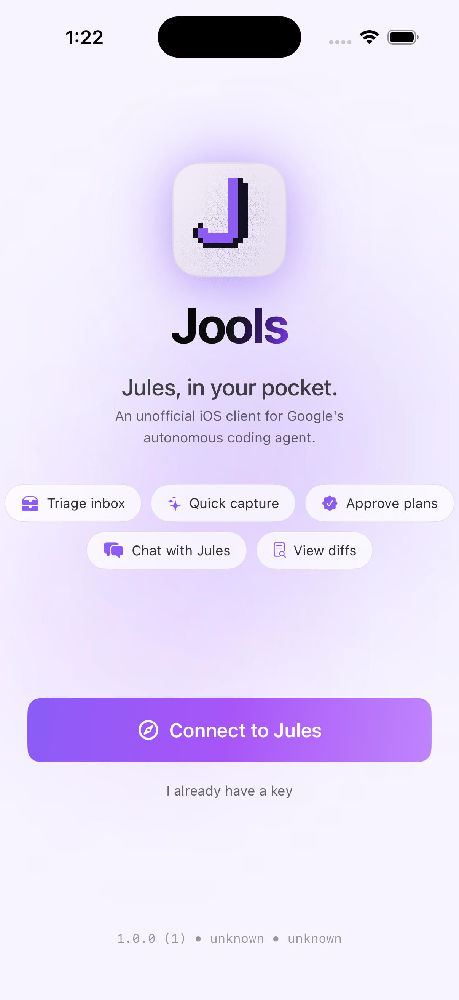
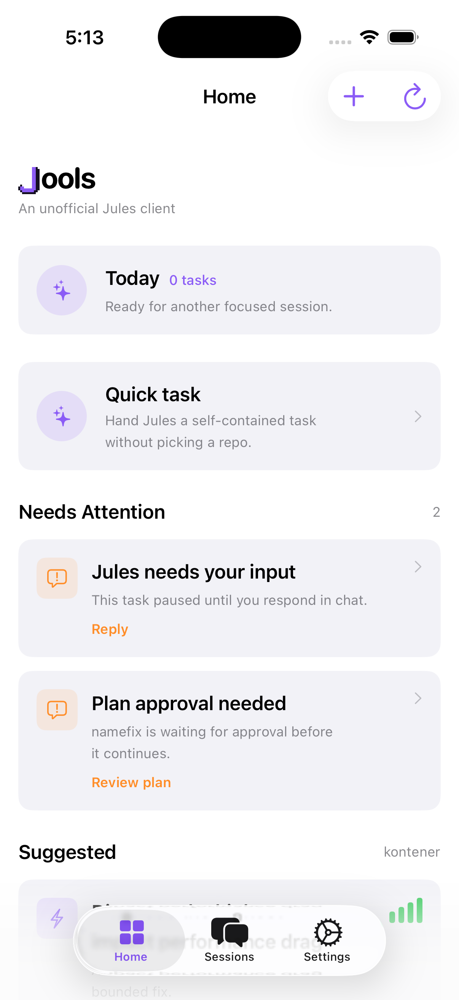
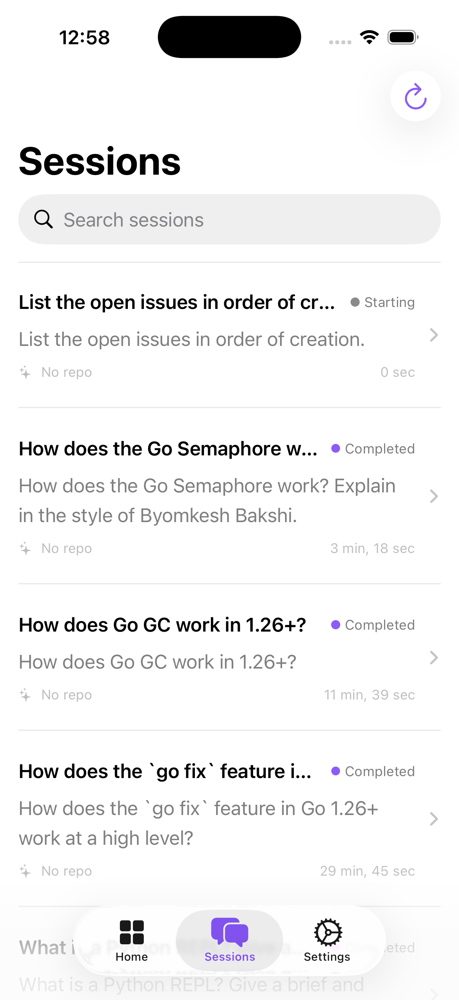
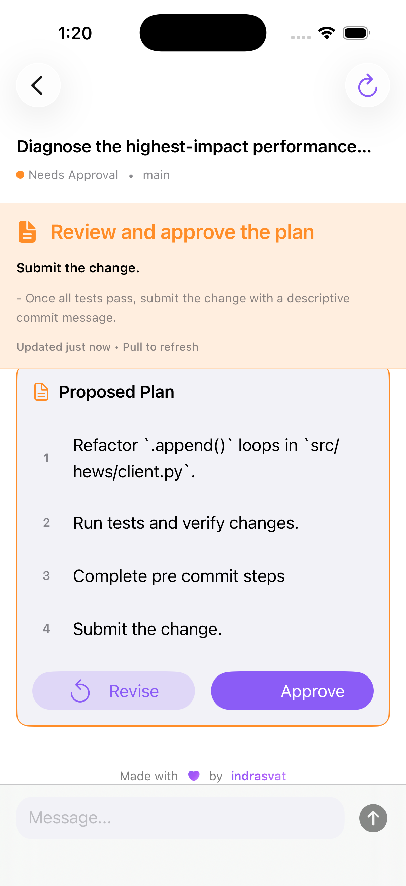
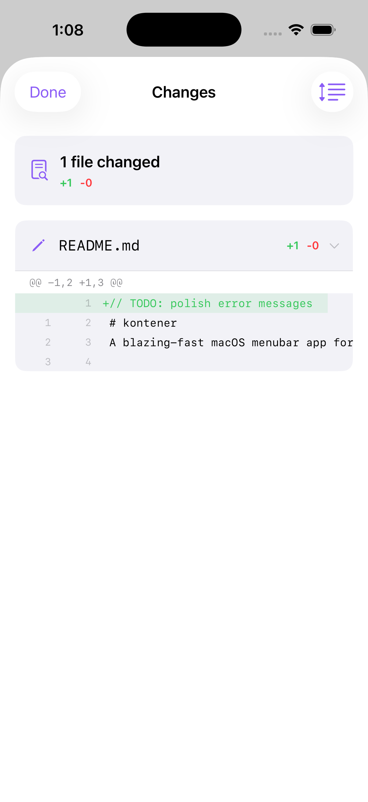
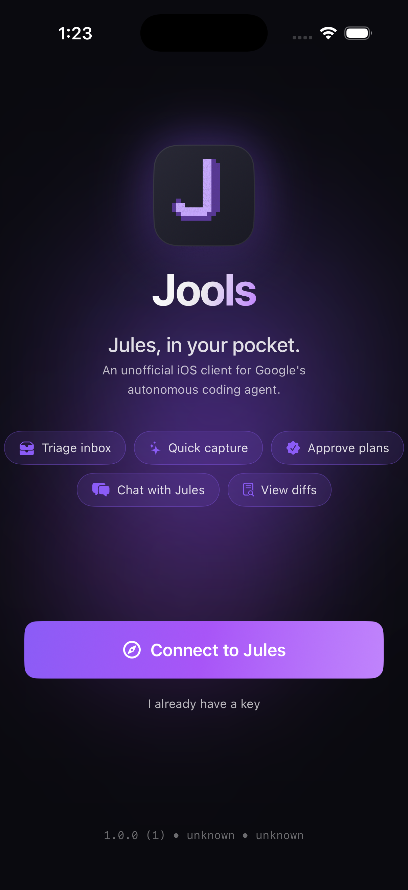
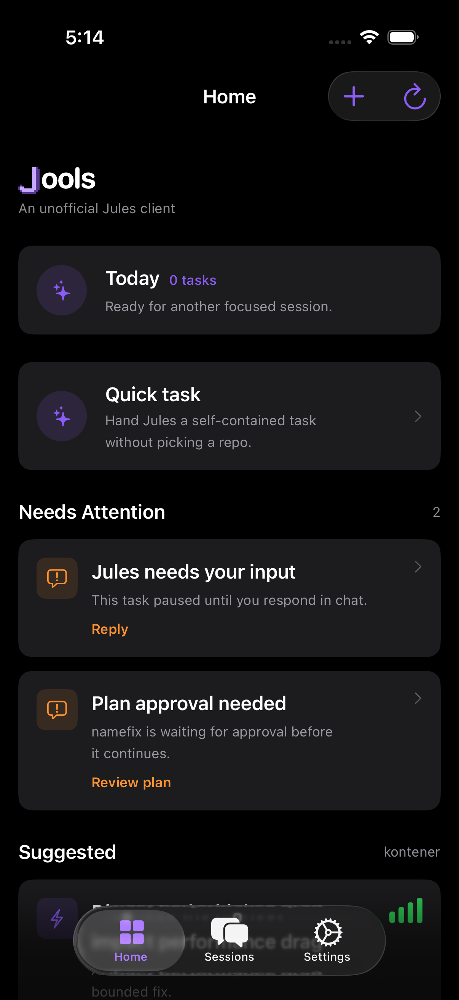
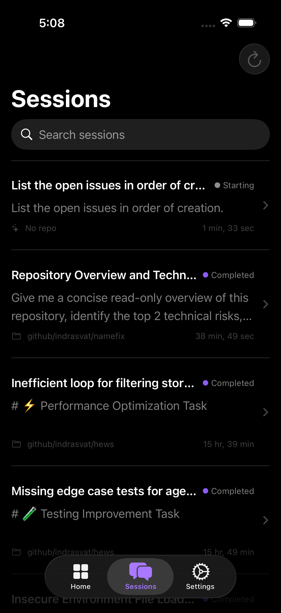
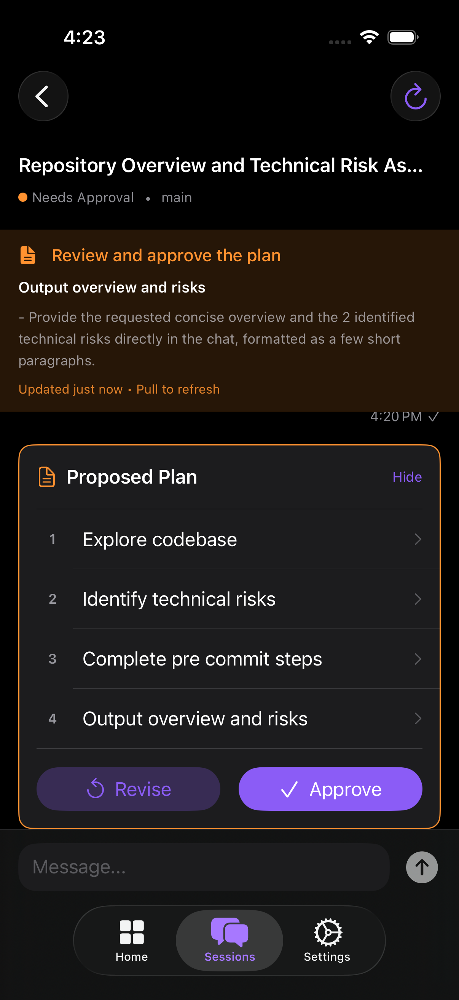
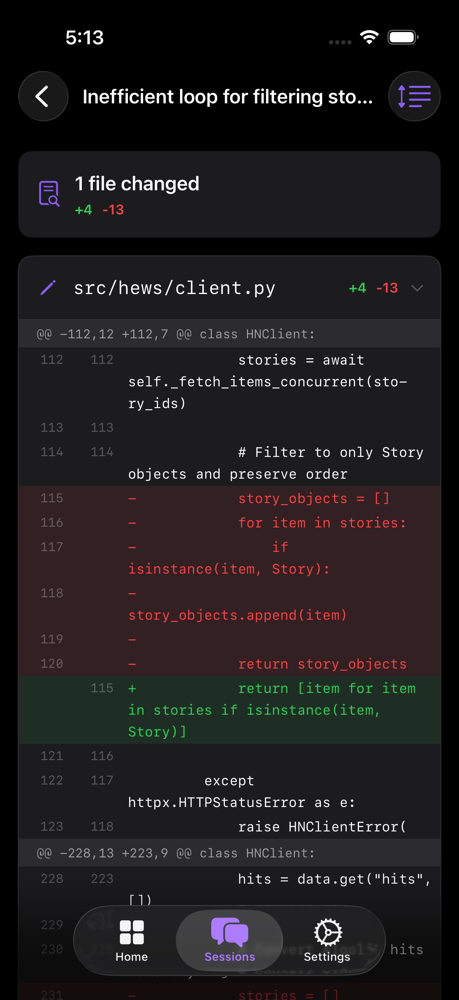

<p align="center">
  
</p>

<h1 align="center">Jools</h1>

<p align="center">
  <a href="https://github.com/indrasvat/jools/actions/workflows/ci.yml">
    
  </a>
</p>

<p align="center">
  <strong>Jules, in your pocket.</strong><br/>
  An unofficial iOS client for <a href="https://jules.google/">Google's Jules</a> — the autonomous coding agent.
</p>

---

Jools is a SwiftUI app that turns the public [Jules REST API](https://jules.google/docs/api/reference/) into a calm, mobile-first control plane. Triage what needs you, approve plans, watch progress, follow up in chat, and check the PR — all from your phone, while the actual coding work happens on Jules's Cloud VMs in the background.

This is **not** affiliated with Google. It's a side project that talks to the same public API any third-party Jules client would.

---

## Screens

|                          |                          |                          |                          |                          |
|:------------------------:|:------------------------:|:------------------------:|:------------------------:|:------------------------:|
|  |  |  |  |  |
|  |  |  |  |  |
| **Onboarding**            | **Home**                  | **Sessions inbox**        | **Plan approval**         | **Per-file diff**         |

Each screen reacts to your active system appearance and respects your in-app theme override (System / Light / Dark).

---

## What you can do today

These are flows that work end-to-end against the real public Jules API:

- **Connect** with your Jules API key (paste, or open Jules in an in-app Safari sheet and capture from clipboard)
- **Browse** every connected GitHub source and every session you've created
- **Triage** sessions from a Home screen that surfaces *Needs Attention* — anything waiting on your input or approval
- **Open a session**, see the full conversation timeline (agent and user messages, plans, progress updates, completion summaries)
- **Send follow-ups** with optimistic UI: your message appears instantly, then reconciles with the server activity once Jules acknowledges it
- **Approve plans** before Jules starts coding — tap once and watch the state machine roll over to *Running*
- **Watch live progress** via adaptive polling that uses the API's `createTime` filter for incremental fetches (with graceful fallback if the backend rejects it)
- **See PR output** when Jules opens a pull request, including the title and description
- **Schedule** repeating tasks via a native composer that hands off to the official Jules web flow when needed
- **Switch themes** in Settings (System / Light / Dark) — preferences persist across app launches

---

## Current limitations

Most of these are upstream constraints, not code we're avoiding writing.

| Limitation | Why |
|---|---|
| No scheduled-task CRUD inside the app | The public Jules REST API doesn't expose scheduled-task endpoints; we hand off to the web UI |
| No suggestions feed | Same — no public endpoint |
| No CI Fixer / Render / MCP integration management | No public endpoints for any of these |
| No per-file diff browser | Only diff stats and changed-file lists are exposed via `changeSet.gitPatch`; a real diff viewer is on the roadmap |
| No media-artifact viewer | The DTOs we model only cover `bashOutput` and `changeSet` artifact types |
| No repoless session creation | The API supports it, but the iOS create-session flow still requires a source — ([planned fix](docs/Jools_Implementation_Plan_v3.md)) |
| Daily-usage shows `n/100` | Jules doesn't expose plan limits via the API; we assume Pro tier as a sane default |
| No remote push notifications | Would require either a Jools-owned backend or upstream webhook support |

For more, see [`docs/Remaining_Work_Plan_2026-04.md`](docs/Remaining_Work_Plan_2026-04.md) and [`docs/Jools_Implementation_Plan_v3.md`](docs/Jools_Implementation_Plan_v3.md).

---

## Building from source

### Requirements

- macOS Sequoia or later
- Xcode 26.0+
- iOS 26.0+ deployment target
- [Homebrew](https://brew.sh)

### One-shot setup

```bash
git clone git@github.com:indrasvat/jools.git
cd jools
./scripts/bootstrap     # installs SwiftLint, XcodeGen, Lefthook; resolves SPM; generates the Xcode project
make xcode              # opens the generated project in Xcode
```

### Common tasks

```bash
make build      # build for simulator (debug)
make test       # run JoolsKit + iOS app tests
make lint       # SwiftLint
make ci         # full CI pipeline (lint + JoolsKit + iOS build + tests)
```

A pre-push git hook (Lefthook) runs lint and a JoolsKit build before every push.

### Getting an API key

The first launch shows the Onboarding screen. Tap **Connect to Jules** to open the Jules API key page in an in-app browser, copy the key, and Jools will offer to use it when you return to the app. You can also paste it manually via **I already have a key**.

---

## Architecture at a glance

```
Jools/                        SwiftUI app
├── App/                      App entry, dependency injection
├── Core/
│   ├── DesignSystem/         Pixel-J brand glyph, colors, typography, spacing, theme settings
│   ├── Navigation/           Root view, tab coordinator
│   └── Persistence/          SwiftData entities (Source, Session, Activity)
└── Features/                 Onboarding, Dashboard, Chat, CreateSession, Settings

JoolsKit/                     Swift package — pure networking + models
└── Sources/JoolsKit/
    ├── API/                  APIClient (actor), Endpoints, NetworkError
    ├── Auth/                 KeychainManager
    ├── Models/               Codable DTOs that mirror the Jules API
    └── Polling/              PollingService — adaptive cadence, foreground/background aware
```

- **MVVM** with `@MainActor` view models, no third-party reactive deps beyond Combine for a few publishers
- **Swift 6** with strict concurrency
- **Actors** for the API client and polling service
- **SwiftData** for the local cache of sources, sessions, and activities
- **SafariServices** for the OAuth-style key capture and the Jules web handoff flow

---

## Disclaimer

Jools is an independent open-source project. It is not built, sponsored, or endorsed by Google. *Jules* is a Google product and trademark; Jools talks to Jules's public REST API the same way any third-party client would. If you're looking for the official experience, that lives at [jules.google.com](https://jules.google.com).

## License

Private repository. All rights reserved.
